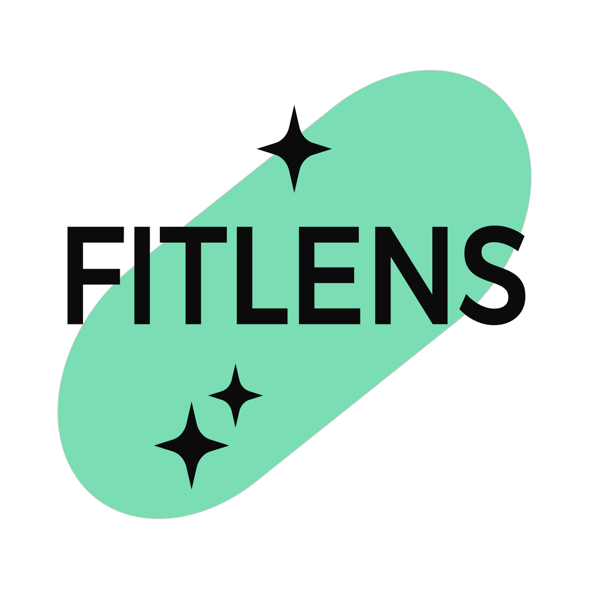

  

# FitLens 

AI-powered calorie tracking with 3D scans. Earn crypto for healthy choices, challenge friends, and unlock a healthier, fitter you!

## Demo

Check out our quick demo to see FitLens in action:

For the full video demonstration, [click here](https://www.youtube.com/shorts/riVvWRWJxPA).

## Features

**In Progress:**
- **AI & 3D Scanning**: Use the iPhone's LiDAR sensor for precise food portion measurements, with AI ensuring nutritional insights.
- **Crypto Rewards**: Earn crypto rewards for achieving nutrition goals, adding an extra incentive to stay healthy.
- **Competitive Challenges**: Engage in challenges with friends to enhance motivation and accountability.

**Implemented:**
- **Image-based Food Logging**: Quickly log your meals by taking a photo. Our AI analyzes the image to provide nutritional information.
- **Nutritional Tracking**: Keep track of your daily intake of calories, carbs, protein, and fat.
- **Analytics**: View detailed insights about your eating habits over time.

## Technologies Used

- SwiftUI for the user interface
- Core Data for local data persistence
- OpenAI API for image analysis and food recognition

## Installation

1. Clone the repository
2. Open the project in Xcode
3. Install the required dependencies
4. Build and run the app on your iOS device

## Configuration

To use the OpenAI API for food recognition, you need to add your API key:

1. Create a `Config.plist` file in the project
2. Add a key `OPENAI_API_KEY` with your OpenAI API key as the value

## Contact

Twitter: [@fitlensdotxyz](https://twitter.com/fitlensdotxyz)

Website: [https://fitlens.xyz](https://fitlens.xyz)

